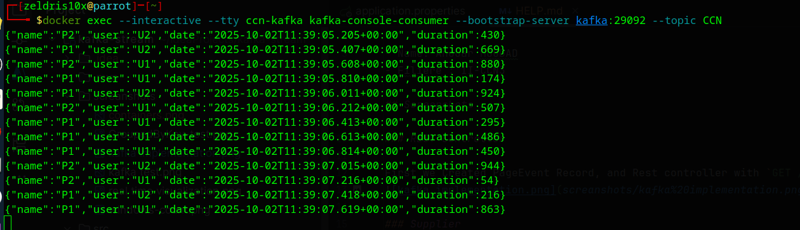
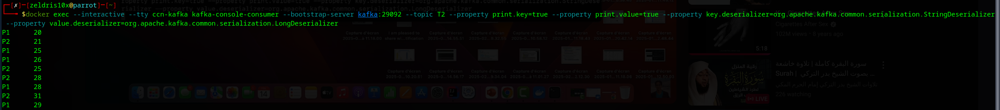

# Spring Cloud Stream - Kafka Streams

## Student Info

- Name: Anouar MOUDAD
- Filiere : II-CCN3

## Screenshots

### REST Controller

First we Created PageEvent Record, and Rest controller with `GET /publish` endpoint to push in our topic (input) using StreamBuilder


### Supplier

Second we created a Supplier and defined output in `appication.properties` with `pageEventSupplier-out-0.destination` this create a stream of mock data into the `CCN` topic with define delay in `appication.properties` with this `pageEventSupplier-out-0.producer.poller.fixed-delay=200`

```properties
spring.cloud.stream.bindings.pageEventSupplier-out-0.destination=CCN
spring.cloud.stream.bindings.pageEventSupplier-out-0.producer.poller.fixed-delay=200
``` 


### Kstream Function

Third we created a Kstream Function that takes input from `CCN` topic filters duration higher than 100 and returns name and duration into topic `T2"`

```java
public Function<KStream<String, PageEvent>, KStream<String, Long>> kStreamFunction() {
    return (input) ->
            input.filter((k, v) -> v.duration() > 100)
                    .map((k, v) -> new KeyValue<>(v.name(), v.duration()))
}
```

```properties
spring.cloud.stream.bindings.kStreamFunction-in-0.destination=CCN
spring.cloud.stream.bindings.kStreamFunction-out-0.destination=T2
```



### Analytics in Index Page

```java
@GetMapping(path = "/analytics",produces = MediaType.TEXT_EVENT_STREAM_VALUE)
public Flux<Map<String, Long>> analytics(){
    return Flux.interval(Duration.ofSeconds(1))
            .map(sequence->{
                Map<String,Long> stringLongMap=new HashMap<>();
                ReadOnlyWindowStore<String, Long> windowStore = interactiveQueryService.getQueryableStore("count-store", QueryableStoreTypes.windowStore());
                Instant now=Instant.now();
                Instant from=now.minusMillis(5000);
                KeyValueIterator<Windowed<String>, Long> fetchAll = windowStore.fetchAll(from, now);
                //WindowStoreIterator<Long> fetchAll = windowStore.fetch(page, from, now);
                while (fetchAll.hasNext()){
                    KeyValue<Windowed<String>, Long> next = fetchAll.next();
                    stringLongMap.put(next.key.key(),next.value);
                }
                return stringLongMap;
            });
}
```

